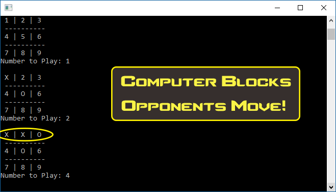

# MiniMax TreeSearch Master Tic-Tac-Toe
## Player Cannot Win, the Computer Triumphs!!

**You the Player plays as ‘X’, while the Computer plays as ‘O’.**

**Computer Blocks Opponents Move!**

**Computer Wins!**

### Cited
Main Picture: https://www.google.com/url?sa=i&source=images&cd=&ved=2ahUKEwipgpem8oLjAhWBbc0KHd9JA_oQjRx6BAgBEAU&url=https%3A%2F%2Fwww.instructables.com%2Fid%2FTic-Tac-Toe-in-Visual-Basic%2F&psig=AOvVaw2xy8tAS7jiVER-6zhpZh71&ust=1561492274393093